## Hollywwod et les métiers du cinéma dans "Sunset Boulevard"

#### Le producteur et le scénariste

| 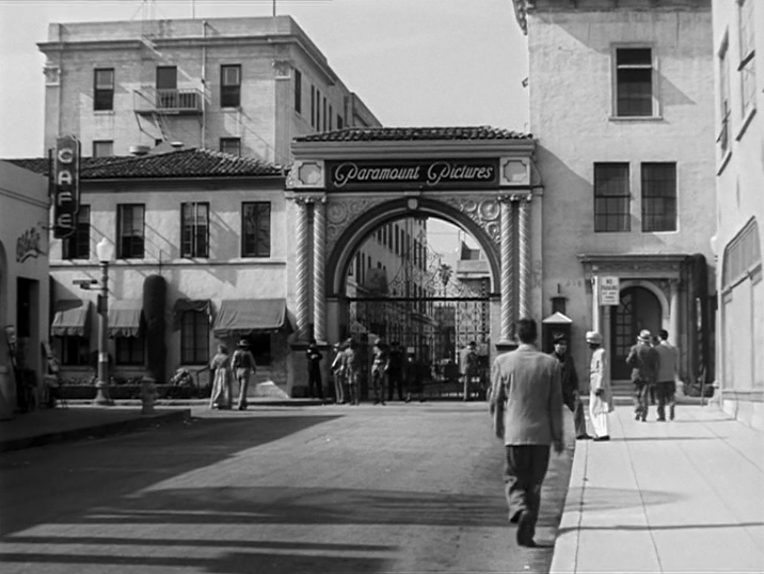  | 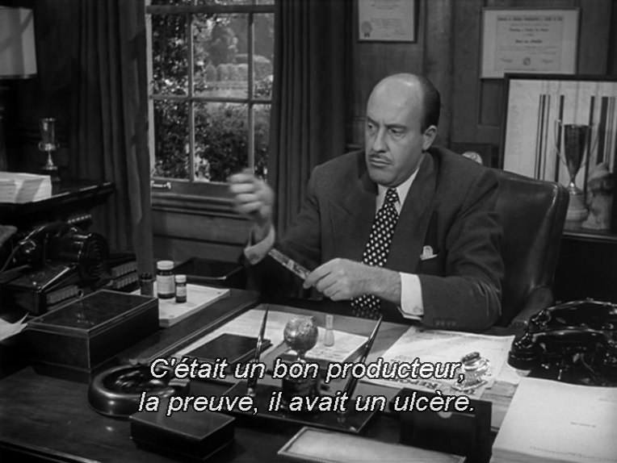  | 
| 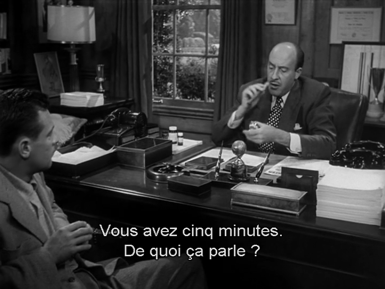 | 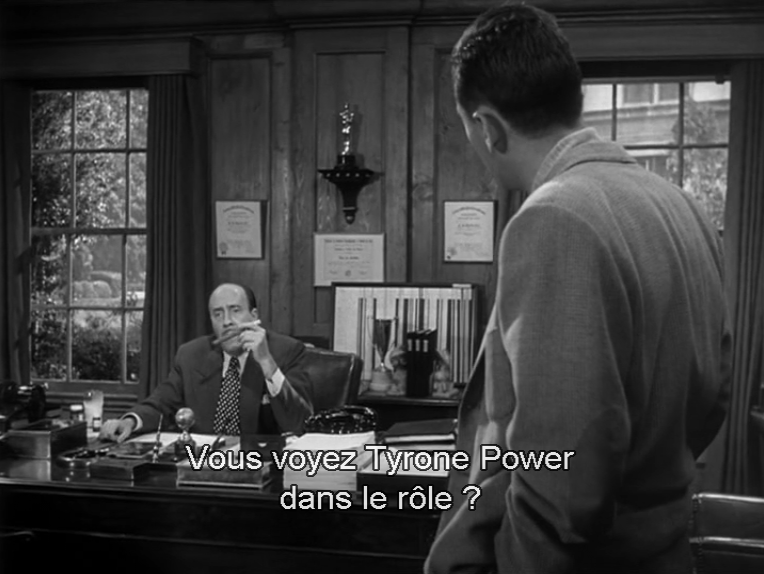  | 

#### L'agent

| 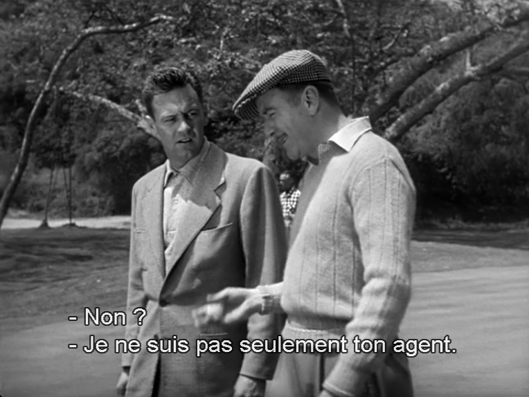  | 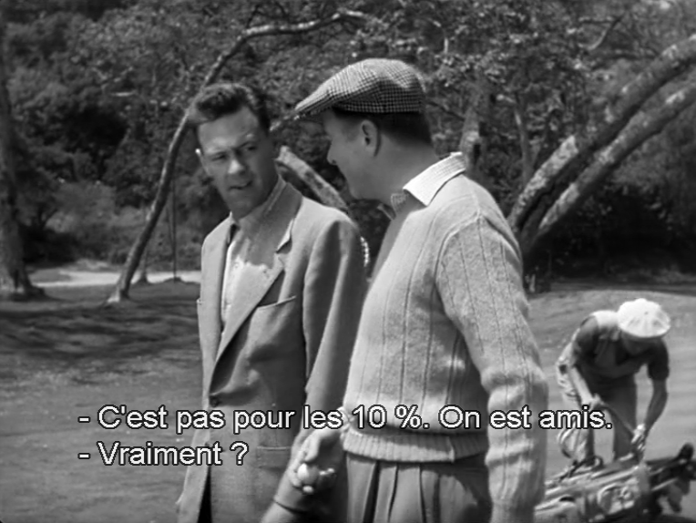  | 

#### L'actrice star

| 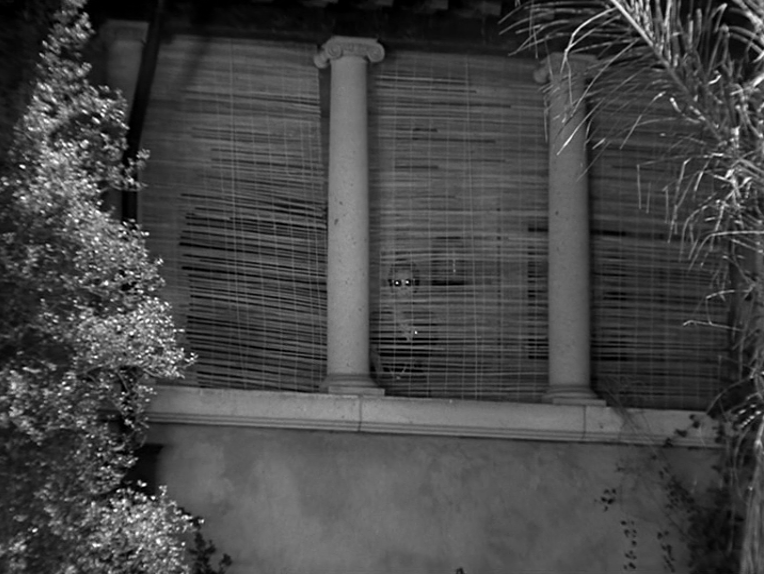  | 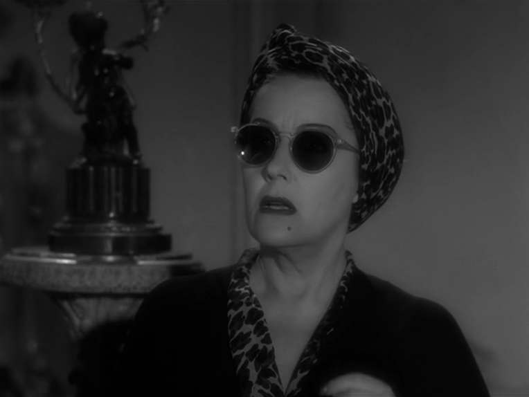  | 
| 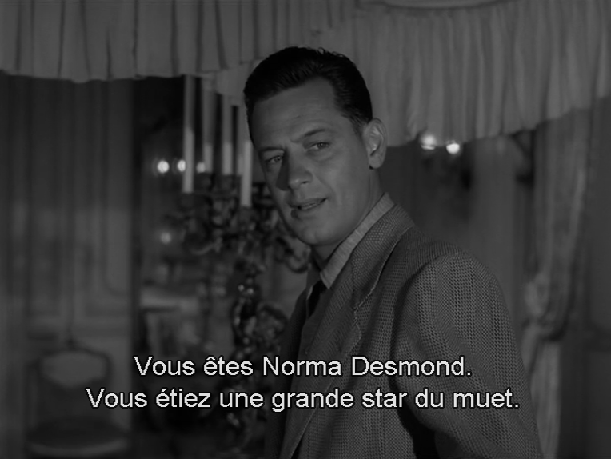 | 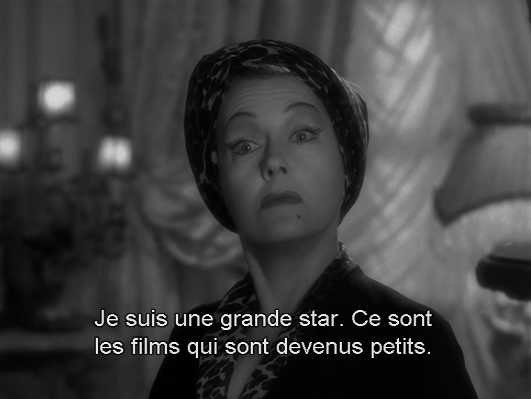  | 

#### Le choc du passage du muet au parlant

| 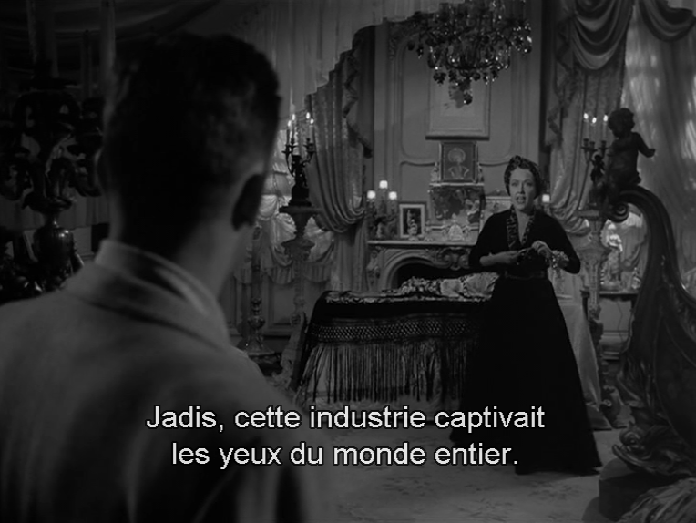  | 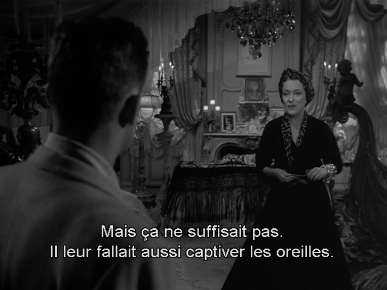  | 
| 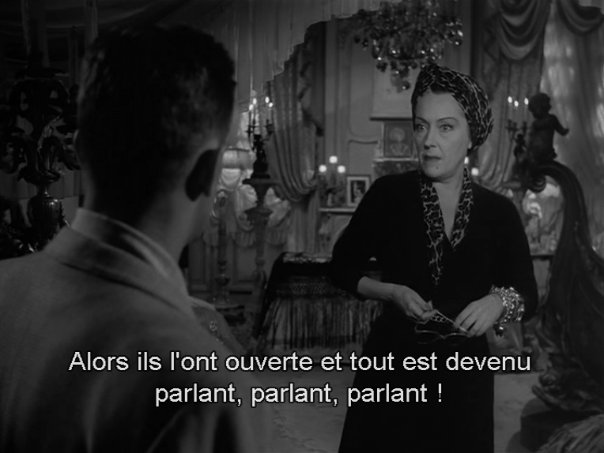 | 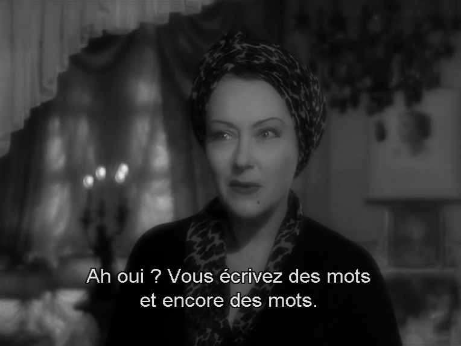  | 
| 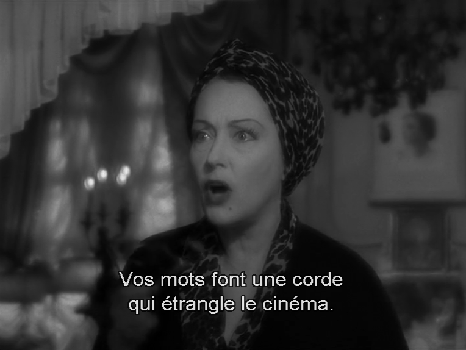 | 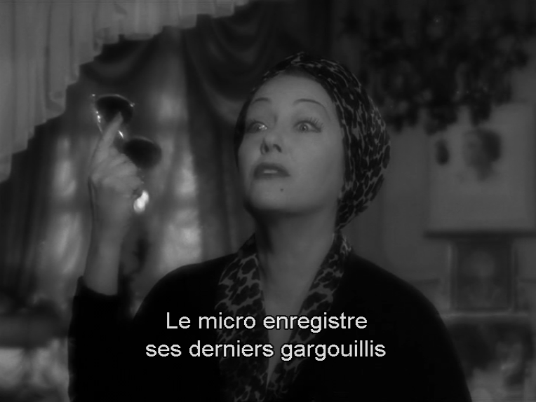  | 

